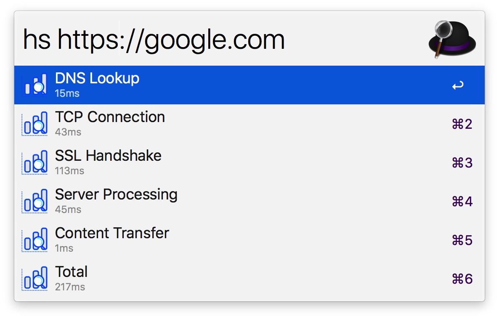

# alfred-httpstat [](https://travis-ci.org/leozhang2018/alfred-httpstat)

> 

> [Alfred 3](https://www.alfredapp.com) httpstat visualizes 

</img>

## Install

```
$ npm install --global alfred-httpstat
```

*Requires [Node.js](https://nodejs.org) 4+ and the Alfred [Powerpack](https://www.alfredapp.com/powerpack/).*


## Usage

In Alfred, type `hs`, <kbd>Enter</kbd>, and your URL query.


## License

MIT © [leozhang2018](http://code.leozhang2018.me)
